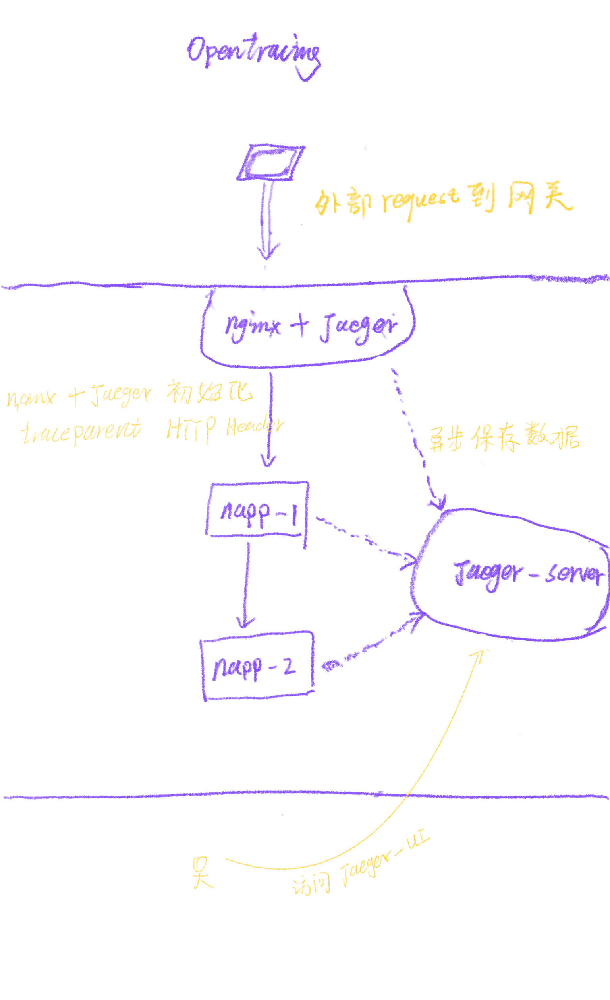

# [Nest](https://github.com/nestjs/nest) Nest + Nginx tracing example

## Description

Before you doing, pls looking at: https://www.notion.so/workspace112/Distributed-Tracing-e855b3dfef304b86a56b6e66d0b6bdb8

架构草图:


## Installation

```bash
$ npm install
```

## Running the app

<!--  -->

```bash
# 运行 nginx + jaeger 环境
$ cd docker && docker-compose up -d

# development
$ npm run start

# watch mode
$ npm run start:dev

# production mode
$ npm run start:prod
```

## Test

```bash
# e2e tests
$ npm run test:e2e

# test coverage
$ npm run test:cov
```

## 完整操作流程

1. 进入 docker 目录, 启动项目 `docker-compose up -d`
2. 访问应用
   ```
   curl --location --request POST 'http://localhost/admin/ping' \
   --header 'Content-Type: application/json' \
   --data-raw '{
    "test": "sdf"
   }'
   ```
3. 访问 Jaeger-UI `http://localhost:16686/` 查看调用栈

## 代码提交标准

```

type(模块): message

  type 用于说明 commit的类别，只允许使用下面7个标识。

  feat：新功能（feature）
  fix：修补bug
  hotfix：紧急修复bug
  test：增加测试
  docs：文档（documentation）
  style： 格式（不影响代码运行的变动）
  refactor：重构（即不是新增功能，也不是修改bug的代码变动）
  chore：构建过程或辅助工具的变动
```

## Stay in touch

- Author - anxing131@gmail.com<anxing>

## License

[MIT licensed](LICENSE).
